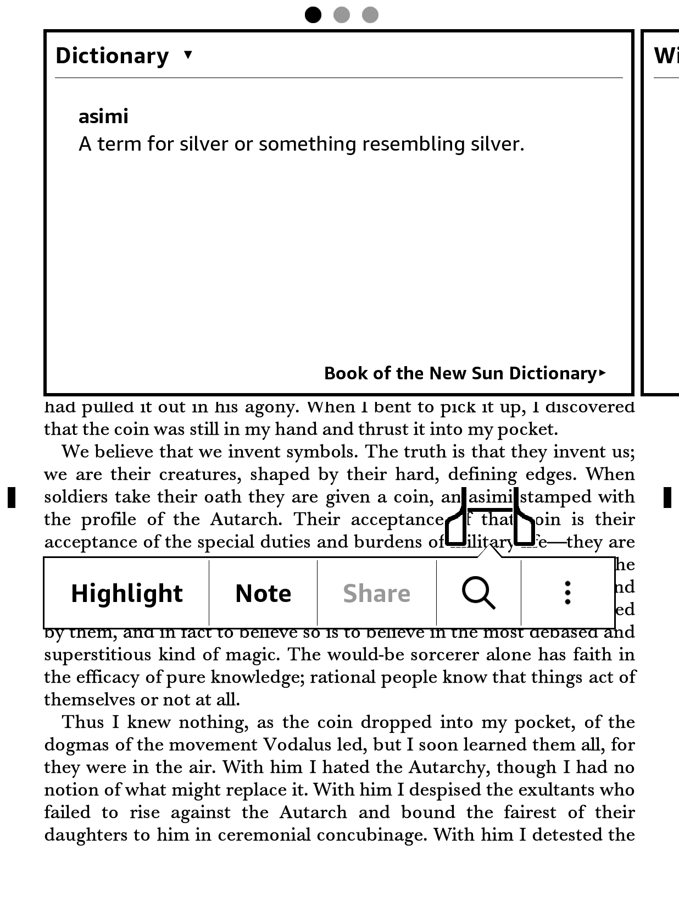

# Kindle Dictionary Creator

This project includes scripts for creating a custom dictionary for Kindle. The process involves extracting unique words from an EPUB file, generating definitions using OpenAI's GPT-4, and then compiling these into a dictionary format compatible with Kindle devices.

## Prerequisites

- Node.js installed on your system.
- An OpenAI API key, set in your environment variables.
- The `epub-parser`, `jsdom`, `dotenv`, and `uuid` packages installed in your Node.js environment.
- The `kindlegen` tool installed for generating the final `.mobi` file.

## Usage

### 1. Extracting Words and Generating Definitions

#### Script: `create-definitions.mjs`

This script extracts unique words from an EPUB file and uses OpenAI's GPT-4 to generate definitions for each word.

To run the script, execute the following command in the terminal:

```bash
node create-definitions.mjs path/to/book.epub path/to/words.txt
```

- `path/to/book.epub` should be replaced with the path to the EPUB file.
- `path/to/words.txt` is a newline-separated file of common words to exclude from the dictionary.

The script will generate a file named `definitions.json` containing the word-definition pairs.

### 2. Creating the Dictionary Files

#### Script: `build-dictionary.mjs`

After generating `definitions.json`, run `build-dictionary.mjs` to create the dictionary files.

```bash
node build-dictionary.mjs "Dictionary Title" "Author Name"
```

- Replace `"Dictionary Title"` with the desired title of your dictionary.
- Replace `"Author Name"` with the name of the dictionary's author (can be fictional).

This script creates several files in the `./output` directory, which are used to compile the final dictionary.

### 3. Compiling the Dictionary

#### KindleGen Command

Use the `kindlegen` tool to compile the dictionary into a `.mobi` file:

```bash
./kindlegen output/dictionary.opf -o dictionary.mobi
```

This command generates `dictionary.mobi`, which can be transferred to your Kindle device.

### 4. Transferring to Kindle

Copy the `dictionary.mobi` file to your Kindle's dictionary directory. The location may vary depending on your Kindle model and settings.

### 5. Screenshot


